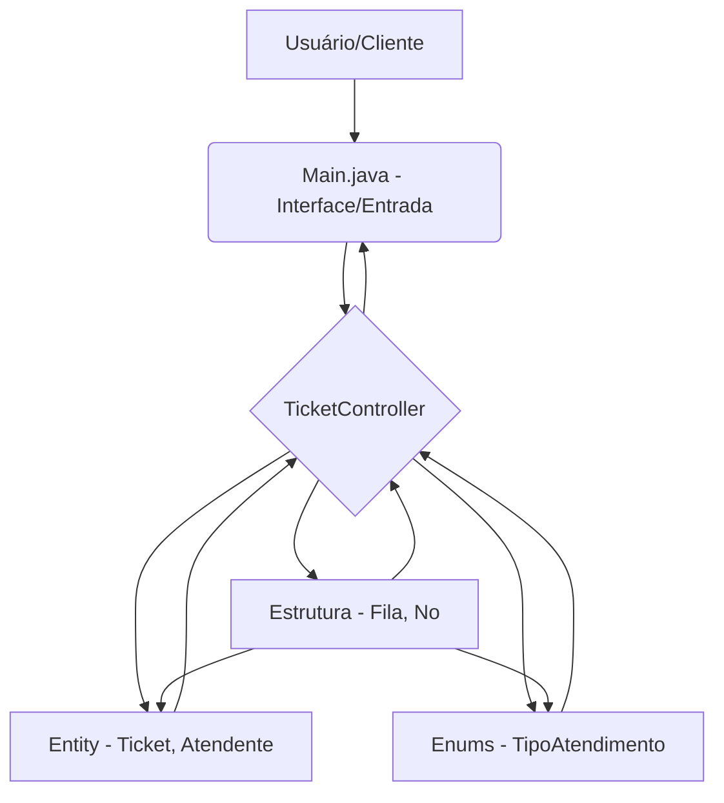
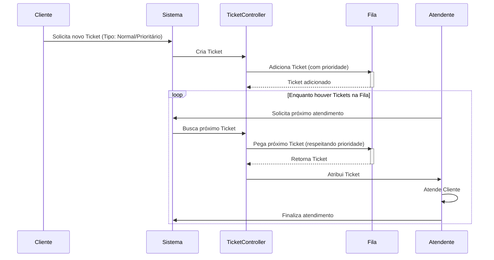

# Fila de Atendimento: Sistema de Gerenciamento de Filas Prioritárias


Este projeto apresenta uma implementação de um sistema de gerenciamento de filas de atendimento, desenvolvido em **Java** com o auxílio do **Apache Maven**. O sistema é projetado para otimizar o fluxo de atendimento ao cliente, incorporando a capacidade de diferenciar e priorizar tickets com base em categorias predefinidas. A solução visa demonstrar conceitos de estruturas de dados e algoritmos em um contexto prático de aplicação.

## Visão Geral do Projeto

A Fila de Atendimento é uma aplicação que simula um ambiente de serviço onde clientes solicitam tickets para serem atendidos. A principal característica do sistema é a gestão de prioridades, garantindo que tickets de alta prioridade sejam processados antes dos de baixa prioridade, enquanto mantém a ordem de chegada dentro de cada categoria. A arquitetura modular facilita a compreensão e a manutenção do código.

## Funcionalidades Implementadas

O sistema oferece as seguintes funcionalidades essenciais para a gestão de filas:

| Funcionalidade | Descrição Detalhada |
| :--- | :--- |
| **Geração de Tickets** | Permite a criação de novos tickets de atendimento, que podem ser categorizados como Normal ou Prioritário. |
| **Gestão de Prioridades** | A fila processa tickets prioritários antes dos tickets normais, assegurando um atendimento eficiente para casos urgentes. |
| **Controle de Atendentes** | O sistema pode ser estendido para gerenciar múltiplos atendentes, distribuindo tickets de forma organizada. |
| **Estrutura de Dados Customizada** | Utiliza uma implementação própria de fila encadeada, demonstrando o controle sobre a estrutura de dados subjacente. |
| **Fluxo de Atendimento** | Gerencia o ciclo de vida de um ticket, desde sua criação até a finalização do atendimento. |

## Arquitetura do Sistema

A arquitetura do projeto é organizada para promover a separação de responsabilidades e a modularidade. O diagrama a seguir ilustra os principais componentes e suas interações:



### Tecnologias Empregadas

O desenvolvimento deste projeto foi realizado utilizando as seguintes tecnologias:

*   **Java**: Linguagem de programação principal, versão 8 ou superior.
*   **Apache Maven**: Ferramenta de automação de build e gerenciamento de dependências.

### Estrutura de Pacotes

A organização do código-fonte segue uma estrutura de pacotes lógica:

*   `controller`: Contém a lógica de controle da aplicação, notavelmente o `TicketController`.
*   `entity`: Define as classes de modelo de dados, como `Atendente` e `Ticket`.
*   `enums`: Inclui enumerações, como `TipoAtendimento`, para categorização de tickets.
*   `estrutura`: Abriga a implementação da estrutura de dados de fila (`Fila` e `No`).
*   `Main.java`: O ponto de entrada da aplicação.

## Fluxo de Atendimento Detalhado

O processo de atendimento de um ticket segue uma sequência bem definida, conforme detalhado no diagrama de sequência abaixo:



## Instruções de Execução

Para compilar e executar o sistema de Fila de Atendimento, siga os passos abaixo:

### Pré-requisitos

Certifique-se de que os seguintes softwares estejam instalados em seu ambiente de desenvolvimento:

*   **Java Development Kit (JDK)**: Versão 8 ou superior.
*   **Apache Maven**: Para gerenciamento de projetos Java.

### Instalação e Compilação

1.  **Clonar o Repositório:**
    Abra um terminal e execute o comando:
    ```bash
    git clone https://github.com/GilvanPedro/Fila_de_Atendemento.git
    cd Fila_de_Atendemento
    ```

2.  **Compilar o Projeto:**
    No diretório raiz do projeto (`Fila_de_Atendemento`), utilize o Maven para compilar:
    ```bash
    mvn clean install
    ```

### Execução da Aplicação

Após a compilação bem-sucedida, o arquivo JAR executável será gerado no diretório `target/`. Para iniciar a aplicação, execute:

```bash
java -jar target/Fila_de_Atendemento-1.0-SNAPSHOT.jar
```

(O nome exato do arquivo JAR pode variar ligeiramente dependendo da versão configurada no `pom.xml`.)

## Contribuição

Contribuições para este projeto são encorajadas. Desenvolvedores interessados em aprimorar o sistema, corrigir anomalias ou adicionar novas funcionalidades são bem-vindos a submeter *issues* ou *pull requests*.

## Licença

Este projeto é distribuído sob os termos da **Licença MIT**. Para informações detalhadas sobre os direitos e permissões, consulte o arquivo [LICENSE](LICENSE) no repositório.

_Desenvolvido por Gilvan Pedro._
